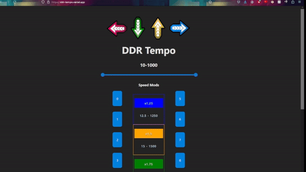

# DDR Tempo

This app is a tool for DDR players, or even other rhythm gamers that allow speed modifiers, to adjust your Tempo/BPM and calculate the adjustments for you.

### Desktop View

### Mobile App

Android APK Download Available:
[Android APK](https://www.mediafire.com/file/ukvfilseayd6al7/ddr-tempo.apk/file)

Tools used:
- React.js
- Vite
- Capacitor
- Material UI
- React Spring
- React Edit Text

Currently, two official plugins are available:

- [@vitejs/plugin-react](https://github.com/vitejs/vite-plugin-react/blob/main/packages/plugin-react/README.md) uses [Babel](https://babeljs.io/) for Fast Refresh
- [@vitejs/plugin-react-swc](https://github.com/vitejs/vite-plugin-react-swc) uses [SWC](https://swc.rs/) for Fast Refresh
